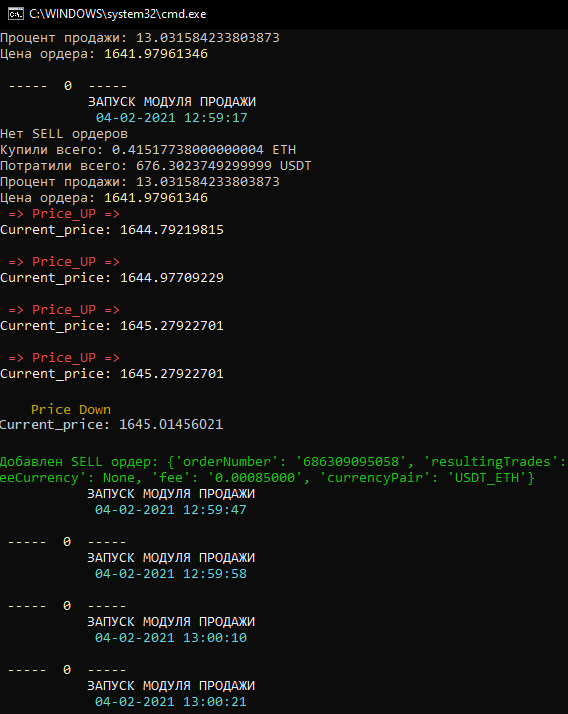

# PoloniexBot2
 
Module "bot_new2" - monitors and places buy orders.
Module "sell2" - monitors the current exchange price, calculates the average sell price, and places an order only if the current price exceeds the calculated one. If during the pause the current price continues to grow, the script will wait, in case of a downward trend in the price, the script will place a sell order, provided that the current price is still higher than the calculated one.

Модуль «bot_new2» - отслеживает и размещает заказы на покупку.
Модуль «sell2» - отслеживает текущую биржевую цену, рассчитывает среднюю цену продажи и размещает ордер только в том случае, если текущая цена превышает расчетную. Если во время паузы текущая цена продолжит расти, скрипт будет ждать, в случае нисходящего тренда цены скрипт выставит ордер на продажу, при условии, что текущая цена все еще выше расчетной. 

